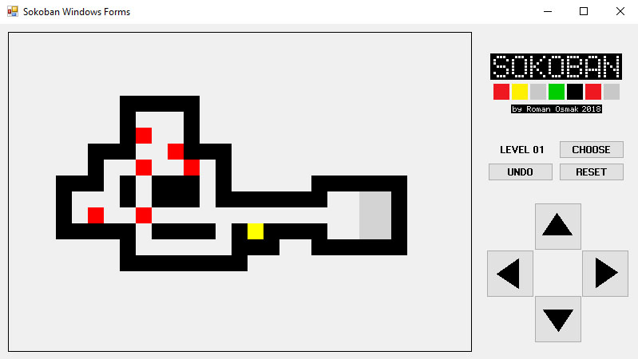

# Sokoban-Windows-Forms

Игра написана на C# Windows Forms (.NET Framework 4.6).

Содержит 60 полностью функциональных уровней.

Из бонусов:

* Возможность выбрать любой уровень
* Возможность отменить сделанный(е) ход(ы) вплоть до начала уровня
* Возможность начать уровень заново

#

#

[Исходный код на GitHub](https://github.com/OsmakRoman/Sokoban-Windows-Forms-source-code.git)

 Скомпилирована на Microsoft Visual Studio 2017 (135 kB)
